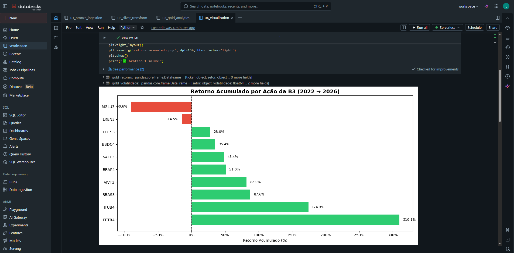
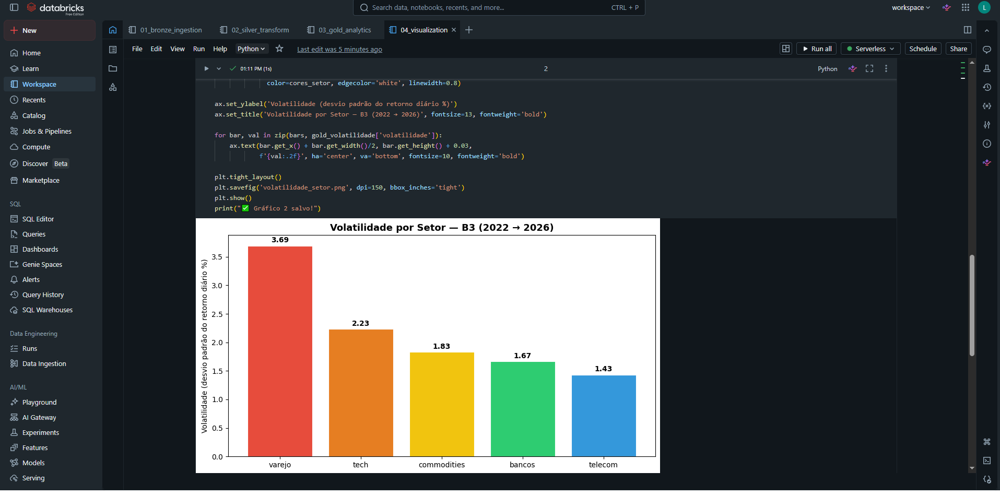

# Pipeline de Ações da B3 com Databricks, Machine Learning e GenAI

Mercado de ações é um assunto que acompanho, e quis usá-lo como base para um projeto prático em Machine Learning, GenAI e Data Engineer.

O projeto começou como um pipeline para coletar e analisar o histórico de dez ações brasileiras desde 2022. Depois, evoluiu para estudar uma pergunta de Machine Learning: o próximo período tende a fechar em alta ou em baixa? Para isso, preparei features diárias e semanais, comparei classificadores com baselines, acompanhei os experimentos com MLflow e processei manchetes com um LLM no Databricks.

O objetivo não é criar uma estratégia automática de investimento. A proposta é mostrar a evolução de um dado desde a ingestão até a experimentação com ML e GenAI, mantendo claras as limitações de cada resultado.

## Arquitetura

Fluxo de preços e dados estruturados:

```text
yfinance
   ↓
Bronze: bronze_b3_stocks
   ↓
Silver: silver_b3_stocks
   ├──→ Gold Analytics: ranking de retorno + volatilidade por setor
   │       ↓
   │    Visualizações
   │
   └──→ Feature Engineering
           ↓
        Features diárias e semanais
           ↓
        Gold ML
           ↓
        XGBoost Classifier → Baseline → Métricas e modelos no MLflow
           ↓
        Estimativas de tendência por ticker
```

Fluxo paralelo de manchetes e dados não estruturados:

```text
Manchetes fictícias
   ↓
Bronze: bronze_noticias
   ↓
LLM: classificação zero-shot
   ↓
Silver: silver_noticias com sentimento estruturado
   ↓
Agregação por ticker
   ↓
Gold: gold_sentimento_ticker
```

- **Bronze:** preserva os dados brutos de cada fonte.
- **Silver:** aplica tipagem, transformações e estrutura os dados para consumo.
- **Gold Analytics:** disponibiliza agregações para análise e visualização.
- **Gold ML:** disponibiliza as features, os targets de tendência e as estimativas mais recentes por ticker.
- **Gold de sentimento:** disponibiliza o sentimento médio agregado por ticker.

Os notebooks são executados manualmente no Databricks. O fluxo de preços compartilha a Silver e depois se divide entre análise descritiva e Machine Learning. O fluxo de notícias é paralelo e ainda não alimenta os modelos XGBoost.

## Fluxo do projeto

### 1. Engenharia de Dados

O `yfinance` coleta preços de abertura, máxima, mínima, fechamento e volume de dez ações. Os dados são convertidos para Spark e gravados em Delta Lake. Na camada Silver, Window Functions separam cada ticker em ordem cronológica para calcular retorno diário e retorno acumulado. A Gold consolida o ranking de retorno e a volatilidade por setor, que alimentam as visualizações do projeto.

#### Resultados da análise descritiva





Na execução registrada:

- PETR4 apresentou o maior retorno acumulado desde 2022, acima de 300%;
- MGLU3 teve queda próxima de 90% no período;
- o varejo apareceu como o setor mais volátil.

### 2. Feature Engineering

No notebook `05_feature_engineering`, os dados tratados da Silver são transformados em duas tabelas Gold preparadas para classificação: uma diária e outra semanal. A proposta é comparar se a redução do ruído diário produz um sinal mais útil no horizonte semanal.

Na base diária, as features usam apenas o fechamento atual e informações passadas:

- retorno diário;
- médias móveis de 5 e 20 pregões e distância do fechamento para cada média;
- momentum de 5 e 20 pregões;
- volatilidade dos retornos em 5 e 20 pregões;
- retornos defasados em 1, 2 e 5 pregões.

Na base semanal, os pregões são agrupados por semana e o fechamento mais recente forma o preço semanal. A mesma ideia é aplicada com janelas de 4 e 12 semanas e lags de 1, 2 e 4 semanas.

Os targets são binários: `1` quando o fechamento do próximo período é maior que o atual e `0` caso contrário. Todas as janelas são particionadas por ticker e ordenadas por data. As features olham somente para o presente e o passado; o próximo fechamento é usado exclusivamente como resposta histórica para o treinamento.

### 3. Machine Learning e MLflow

No notebook `06_ml_training`, as tabelas são convertidas para pandas por terem volume adequado ao processamento em memória. Os 20% finais das datas formam o teste e uma observação é retirada entre treino e teste, pois o target olha um período à frente. Não há embaralhamento aleatório. Assim, o teste representa um período posterior ao treino e reduz o risco de *data leakage*.

Foram treinados dois `XGBClassifier`, um para o próximo pregão e outro para a próxima semana. Cada modelo foi comparado com um baseline que sempre prevê a classe mais frequente no treino.

| Horizonte | Abordagem | Accuracy | Balanced accuracy | ROC-AUC |
|---|---|---:|---:|---:|
| Diário | XGBoost | 51,93% | 51,75% | 52,14% |
| Diário | Baseline | 51,67% | 50,00% | 50,00% |
| Semanal | XGBoost | **55,43%** | **55,26%** | **57,38%** |
| Semanal | Baseline | 51,09% | 50,00% | 50,00% |

Accuracy mede o percentual total de acertos. Balanced accuracy calcula o desempenho de forma equilibrada entre alta e baixa, sendo útil quando as classes não aparecem na mesma proporção. ROC-AUC mede a capacidade de ordenar casos de alta acima dos casos de baixa em diferentes limiares.

No horizonte diário, o resultado ficou muito próximo do baseline e de uma classificação aleatória. No semanal, o XGBoost superou o baseline nas três métricas da tabela. O ROC-AUC de 57,38% indica um sinal modesto no recorte de teste, não evidência suficiente para uma estratégia de investimento.

Cada treinamento é registrado como um run separado no MLflow. Parâmetros, métricas de classificação, métricas do baseline e o artefato do modelo ficam associados ao experimento. Ao final, uma versão treinada com todo o histórico rotulado produz probabilidades recentes por ticker. Probabilidades entre 45% e 55% são apresentadas como `indefinida`, evitando transformar resultados próximos de 50% em uma certeza artificial.

### 4. GenAI e classificação de sentimento

O notebook `07_news_sentiment` adiciona dados não estruturados ao projeto. Um LLM disponível por endpoint no Databricks recebe um prompt e classifica cada manchete como `positivo`, `neutro` ou `negativo`.

Essa abordagem é uma **zero-shot sentiment classification**: o LLM não é treinado novamente com exemplos do projeto. Ele usa o conhecimento adquirido no pré-treinamento e segue a instrução fornecida no prompt. A resposta textual é normalizada e convertida em uma representação numérica:

```text
positivo = 1
neutro   = 0
negativo = -1
```

Depois, o resultado é salvo na Silver e agregado por ticker na tabela `b3_pipeline.gold_sentimento_ticker`. Assim, a saída do LLM deixa de ser apenas texto e passa a ter uma estrutura que pode ser integrada a análises ou modelos futuros.

As 24 manchetes desse notebook são fictícias e foram escritas apenas para fins educacionais. Elas estão identificadas como tal na coluna `nota`. O volume é suficiente para demonstrar o processamento com LLM, mas não para testar se sentimento melhora a previsão do mercado.

## Resultados e aprendizados de IA

- A classificação do próximo pregão ficou praticamente empatada com o baseline, confirmando a dificuldade de encontrar sinal no horizonte diário.
- A classificação semanal foi mais promissora: atingiu 55,43% de accuracy e ROC-AUC de 57,38%, acima dos 51,09% e 50% do baseline.
- O LLM transformou as manchetes em sentimento estruturado, mas esse dado ainda não foi integrado ao treinamento dos modelos.

O principal aprendizado foi que mudar o horizonte altera o comportamento do problema. O fechamento diário apresentou muito ruído, enquanto a agregação semanal preservou um sinal pequeno no período avaliado. O projeto também mostrou como transformar a saída textual de um LLM em dado estruturado dentro da mesma arquitetura em camadas.

## Notebooks

### Engenharia de Dados

| Notebook | Responsabilidade |
|---|---|
| `01_bronze_ingestion` | Coleta preços com `yfinance` e grava os dados brutos em Delta Lake. |
| `02_silver_transform` | Aplica tipagem e calcula retorno diário e acumulado com Window Functions. |
| `03_gold_analytics` | Gera o ranking de retorno e a volatilidade por setor. |
| `04_visualization` | Cria os gráficos com matplotlib. |

### Machine Learning

| Notebook | Responsabilidade |
|---|---|
| `05_feature_engineering` | Cria features e targets binários de tendência para os horizontes diário e semanal. |
| `06_ml_training` | Treina classificadores XGBoost, aplica separação temporal, compara cada horizonte com seu baseline, registra os runs no MLflow e gera estimativas recentes. |

### GenAI

| Notebook | Responsabilidade |
|---|---|
| `07_news_sentiment` | Usa um LLM para classificar manchetes e grava o sentimento estruturado em Silver e Gold. |

## Tecnologias utilizadas

- Python, pandas e matplotlib
- PySpark e Spark SQL
- Delta Lake e arquitetura Bronze, Silver e Gold
- Databricks Free Edition
- yfinance
- XGBoost e scikit-learn
- MLflow
- Databricks Model Serving / Foundation Model API
- LLM, prompt engineering e zero-shot classification

## Como executar

1. Crie um workspace no [Databricks Free Edition](https://www.databricks.com/learn/free-edition).
2. Importe os notebooks da pasta `notebooks`.
3. Execute os notebooks de `01` a `06` em ordem. O notebook `07` representa um fluxo paralelo e pode ser executado separadamente.
4. No notebook `07`, execute primeiro a listagem de endpoints e confirme o nome do LLM disponível no workspace antes de iniciar a classificação.

As dependências são instaladas nos próprios notebooks com `%pip install`. As tabelas são sobrescritas durante a execução, portanto uma versão atualizada de um notebook deve ser executada antes dos notebooks que dependem dela.

## Limitações e próximos passos

- A execução ainda é manual. Databricks Jobs ou Airflow poderiam organizar dependências, tentativas e agendamento.
- A avaliação dos classificadores usa um único corte temporal de 80/20. Uma validação *walk-forward* daria uma visão mais consistente do desempenho ao longo de diferentes períodos.
- Os resultados refletem dez ações e o período iniciado em 2022. Eles não devem ser interpretados como recomendação de investimento.
- O modelo diário ficou próximo do acaso. O semanal superou o baseline no corte atual, mas o ganho ainda é pequeno e precisa ser validado em outros períodos.
- As classificações `alta`, `baixa` e `indefinida` demonstram a saída técnica do pipeline. Relacioná-las a posições compradas ou vendidas exigiria backtest com custos, regras de entrada e saída, drawdown, controle de risco e teste em ambiente simulado.
- As manchetes são fictícias e pouco numerosas. Um experimento estatístico exigiria notícias reais, mais observações e alinhamento temporal com os pregões.
- A tabela Gold de sentimento está pronta para integração, mas o notebook atual ainda não a adiciona às features nem retreina os modelos com essa informação.
